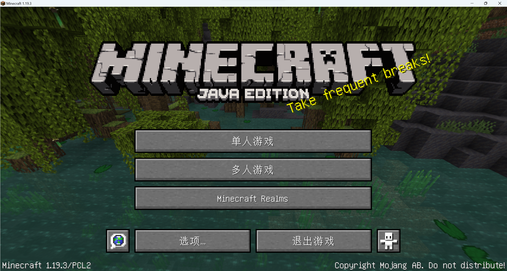

#                              Minecrift

###                                          中文名：我的世界

百度百科如是介绍道：

2009年瑞典Mojang Studios开发的沙盒游戏

《我的世界》*（**[Minecraft](https://baike.baidu.com/item/Minecraft/4623854?fromModule=lemma_inlink)**）*是一款[沙盒](https://baike.baidu.com/item/沙盒/3769297?fromModule=lemma_inlink)类[电子游戏](https://baike.baidu.com/item/电子游戏/195750?fromModule=lemma_inlink)，开创者为[马库斯·阿列克谢·泊松](https://baike.baidu.com/item/马库斯·阿列克谢·泊松/6980057?fromModule=lemma_inlink)*（Notch）*。游戏由[Mojang](https://baike.baidu.com/item/Mojang/2253597?fromModule=lemma_inlink) Studios维护，现隶属于[微软](https://baike.baidu.com/item/微软/124767?fromModule=lemma_inlink)[Xbox](https://baike.baidu.com/item/Xbox/277794?fromModule=lemma_inlink)游戏工作室。中国版现由[网易游戏](https://baike.baidu.com/item/网易游戏/1918119?fromModule=lemma_inlink)代理 [26] ，于2017年8月8日在[中国大陆](https://baike.baidu.com/item/中国大陆/5944925?fromModule=lemma_inlink)运营。

自开创伊始到延斯·伯根斯坦（Jeb）加入并负责开发之前，我的世界几乎全部的开发工作由[Notch](https://baike.baidu.com/item/Notch/10177581?fromModule=lemma_inlink)完成。游戏音乐由[丹尼尔·罗森菲尔德](https://baike.baidu.com/item/丹尼尔·罗森菲尔德/16822413?fromModule=lemma_inlink)（C418）和莉娜·雷恩（Lena Raine）创作；克里斯托弗·泽特斯特兰绘制了游戏中的画。游戏最初于2009年5月17日作为Classic版本发布，并于2011年11月18日发布[Java](https://baike.baidu.com/item/Java/85979?fromModule=lemma_inlink)正式版。我的世界的游戏平台囊括桌面设备、移动设备和游戏主机。 [4] 

该游戏以玩家在一个充满着方块的三维空间中自由地创造和破坏不同种类的方块为主题。玩家在游戏中可以在单人或多人模式中通过摧毁或创造精妙绝伦的建筑物和艺术，或者收集物品探索地图以完成游戏的[成就](https://baike.baidu.com/item/成就/19928754?fromModule=lemma_inlink)（[进度](https://baike.baidu.com/item/进度/24472016?fromModule=lemma_inlink)）。玩家也可以尝试在创造模式下(打开作弊)[红石电路](https://baike.baidu.com/item/红石电路/6384512?fromModule=lemma_inlink)和[指令](https://baike.baidu.com/item/指令/18765029?fromModule=lemma_inlink)等玩法。

### 我的       我的世界：

我很乐意去分享我眼中的我的世界

我愿称它为我的生命中遇到的最好的游戏，我刚开始接触它时才八岁，家中并没有电脑，我所见的我的世界是手游版（也就是pe版），然而我并不知道它在2009年便已推出。它的高度自由和毫无指引让我一时不知道如何去玩，但久而久之，我明白了，自由与创造便是这个游戏的真谛，它不需要任何约束。去把脑中的想法变为现实！just do it！后来

多玩我的世界盒子

进入了我的视野，在网易代理我的世界之前，它发扬了手游我的世界，让它变得可玩性更高，各种mod 光影 地图 服务器 。后来推出的

多玩我的世界联机盒子

更是让手游玩家着迷，why？因为多人一起玩更加方便了，在王者荣耀出来之前，中国那些接触不到电脑孩子中许多都会去玩儿我的世界

